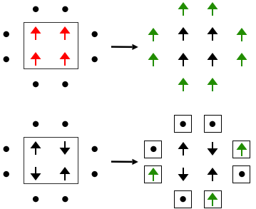
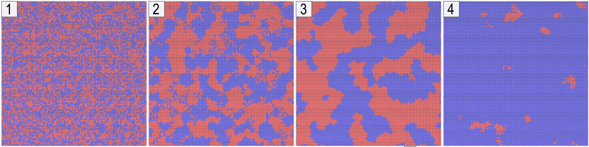

# Effect of Social Media on Opinion Formation
In this simulation we investigate the effect of social media on the process of opinion formation in a human population. This effect is modeled as an external field in the dynamics of the two-dimensional *Sznajd model* with a probability `P` for an agent to follow the social media. We investigate the evolution of magnetization, the distribution of decision time and the average relaxation time in the presence of the external field.

## Method
We consider two-dimensional Sznajd model on a square lattice of size **L** and periodic boundary condition with `N = L × L` agents and Ising spins of `±1` for each site. We model the effect of social media as an external filed applied on each site uniformly. The following rules governs our model:
* In each step a `2 × 2` panel is randomly selected.
* If all four center spins are parallel, the eight nearest neighbors are persuaded to follow the panel orientation. 
* If not all four center spins are parallel, consider the influence of social media (external field): each one of the eight neighbors follows, independently of the others, with probability `P`.

The effect of social media is considered toward +1 opinion; in other words, at each time step each neighbor will change his (her) opinion to +1 with a probability of `P` if he (she) could not be persuaded by the `2 × 2` agents. In this model, the effect of social validation (group of agents) is stronger than the effect of the social media i.e. an individual is more likely to follow friends, relative or colleagues and is only influenced by the social media if there's no consensus among them.

Schematic representation of two-dimensional Sznajd model with an external field is illustrated below:
<p align='center'>  
  
  <br />
  A panel of (2 × 2) spins influence neighboring spins denoted by dots (top) 
  <br />
  Each agents independently of the others is influenced by the social media (bottom)
</p>

For simplicity we assume that all agents are exposed uniformly to the social media and visualize the effect of social media on the social opinions of the system to see how opinions are formed in time. The `-1` and `+1` states of agents are visualized with `red` and `blue` colors respectively. It can be seen that *United we Stand Divided we Fall* nature of Sznajd model causes agents with the same opinion to form clusters to survive.
<p align='center'>  
  
  <br />
  Dynamic evolution of two-dimensional Sznajd model at different time-steps
</p>

Dynamic evolution of two-dimensional Sznajd model on a lattice of `L=100` with initial concentration of up spins `0.5` and external force `P=0.1` at different time-steps is shown here. `t = 0 (1)`, `t = 100 (2)`, `t = 1000 (3)`, `t = 2000 (4)` where one time-step is equal to `1e4` Monte Carlo steps. Blue and Red agents represent `yes (1)` and `no (-1)` opinions respectively. Visualization is performed in *Visual Molecular Dynamics (VMD)* software package.


## Citation
If you use this code for your research, please cite our paper <a href="https://arxiv.org/abs/1805.08310">Effect of Social Media on Opinion Formation</a>:

```
@article{nazeri2018effect,
  title={Effect of Social Media on Opinion Formation},
  author={Nazeri, Kamyar},
  journal={arXiv preprint arXiv:1805.08310},
  year={2018}
}
```
